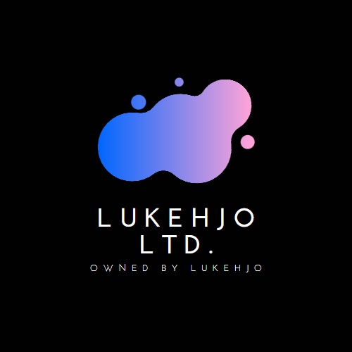

# Who are we?

### Hello! We are LukeHjo Ltd.

  

### About Us
---

Hey! We are LukeHjo Ltd. We are a tema of software engineers from Sweden. 
We work on various projects all the time such as [github.com/luke-beep/guide-to-optimizing-windows](https://github.com/luke-beep/guide-to-optimizing-windows). Or [https://lukehjo.rocks](https://lukehjo.rocks)

### Languages 

---
I'm currently learning Python, HTML, CSS, Javascript, C# and bootstrap.

### Github Statistics

---

### Contact Information

---

If you need to contact us you can do it by either gmail or discord.

